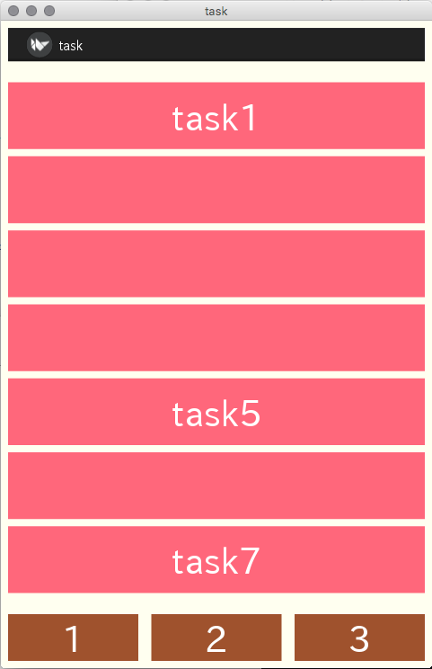
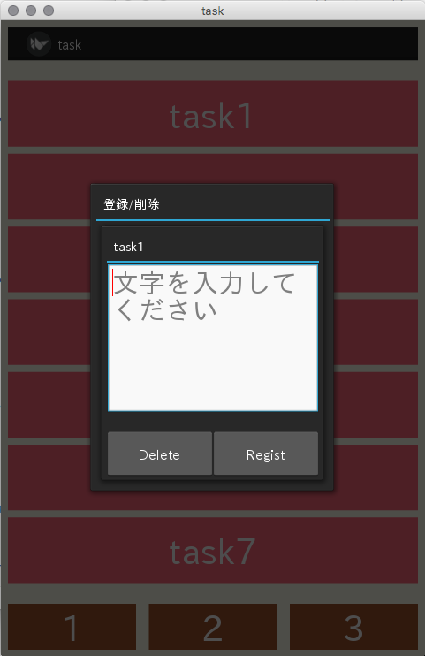

# kivy

## 概要
Kivyで様々なことを試したプログラムのまとめ。

## ポップアップウィンドウ+入力フォーム(task)
task：Kivyでポップアップウィンドウを表示する際、ポップアップ上で入力した文字列を親ウィンドウに渡したり入力内容をcsvファイルに保存したりするやり方の勉強のために作ったアプリ。

Kivyを使ってポップアップウィンドウを表示したい場合はmain.pyファイルに
~~~
content = PopupWindow(<ポップアップウィンドウ上に表示したいウィジェットの記述>)
self.popup = Popup(title=<タイトル名>, content=content, <サイズ指定など>)
self.popup.open()
~~~
といったような記述をすることで作成できます。kvファイルのポップアップウィンドウに対応する部分にTextInputを書くことで入力フォームをポップアップ上に配置することもできます。フォーム上に入力した内容については、このプログラムの場合registボタンを押した時に呼び出される関数に入力内容を引数として渡すことで親ウィンドウに渡しています。

   
